# 🛍️ Ecommerce Clothing Sales

## Overview

This is a full-stack e-commerce platform built with modern web technologies for both frontend and backend. The application provides a comprehensive set of features for managing users, products, orders, and more — with a strong focus on scalability, user experience, and secure transactions.

## 🔗 Test Project

[👉 Live Demo](https://trendory.vercel.app/)

---

## ✨ Features

- **User Management**: Register, login, profile management, and role-based access control.
- **Product Management**: Add, edit, delete, and categorize products with rich text descriptions.
- **Discount Code Management**: Create and apply discount codes for promotions.
- **Cart Management**: Add, remove, and update items in the shopping cart.
- **Wishlist**: Save favorite products for later.
- **Order Management**: Track and manage customer orders with status updates.
- **Product Reviews**: Allow users to leave personal comments and ratings.
- **Recommendation System**: Suggest products based on user behavior.
- **Blog System**: Create and manage blog posts for content marketing.
- **Search & Filters**: Search products by keywords, categories, or advanced filters.
- **Payment Integration**: Secure payments via **ZaloPay** and **Stripe**.
- **AI Chatbot**: Interactive customer support chatbot.
- **Revenue Statistics**: Generate sales and revenue reports.
- **Product Analytics**: Analyze product performance and popularity.

---

## 🧱 Tech Stack

### Admin Dashboard

- `@mui/material`: UI components for building admin interfaces.
- `@tanstack/react-query`: State and async data management.
- `tinymce`: Rich text editor.
- `recharts`: Charts and visual analytics.
- `vite`: Frontend build tool.
- `typescript`: Strongly typed JavaScript.

### Frontend

- `react`: Core UI library.
- `zustand`: State management.
- `react-query`: Data fetching and caching.
- `antd`: Component UI library.
- `tailwindcss`: Utility-first CSS.
- `stripe`: Payment processing integration.
- `lightbox.js-react`: Product image gallery.

### Backend

- `express`: Web server framework.
- `mongoose`: MongoDB ODM.
- `jsonwebtoken`: Authentication with JWT.
- `stripe`: Payment processing.
- `nodemailer`: Email sending.
- `bcrypt`: Password hashing.
- `dotenv`: Environment configuration.
- `cloudinary`: Image storage and optimization.

---

## ⚙️ Installation

### Prerequisites

- Node.js (v18 or above)
- MongoDB
- Cloudinary account
- Stripe account
- ZaloPay account

### Setup Steps

1. Clone the repository
2. Install dependencies for both frontend and backend
3. Set up your `.env` files (see example below)
4. Run the frontend and backend

```bash
# Frontend
cd frontend
npm install
npm run dev

# Backend
cd ../backend
npm install
npm start


```

## 🖼️ Screenshot

### CUSTOMER

### Register


### Login


### HomePage


### Product list page


### Product detail page

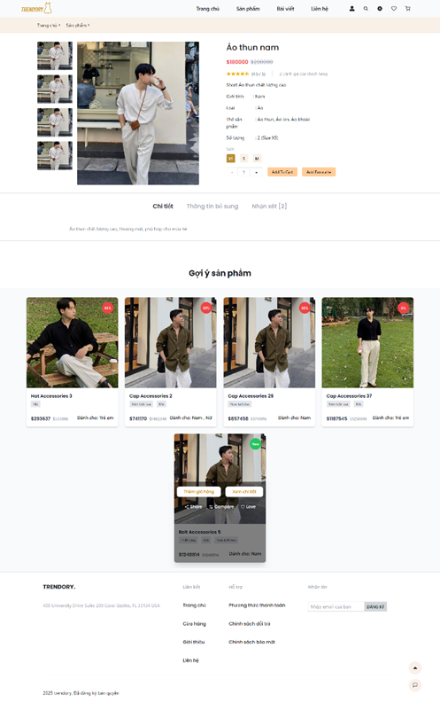

### Favorite products section

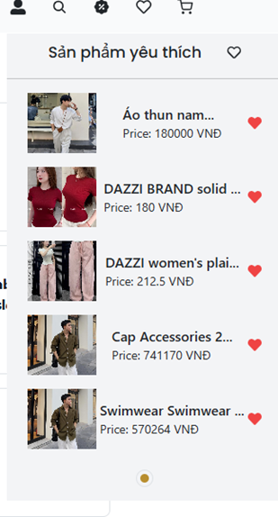

### Product review section

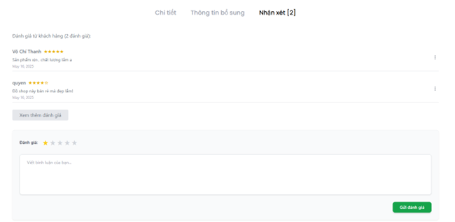

### Shop article page


### Personal information page

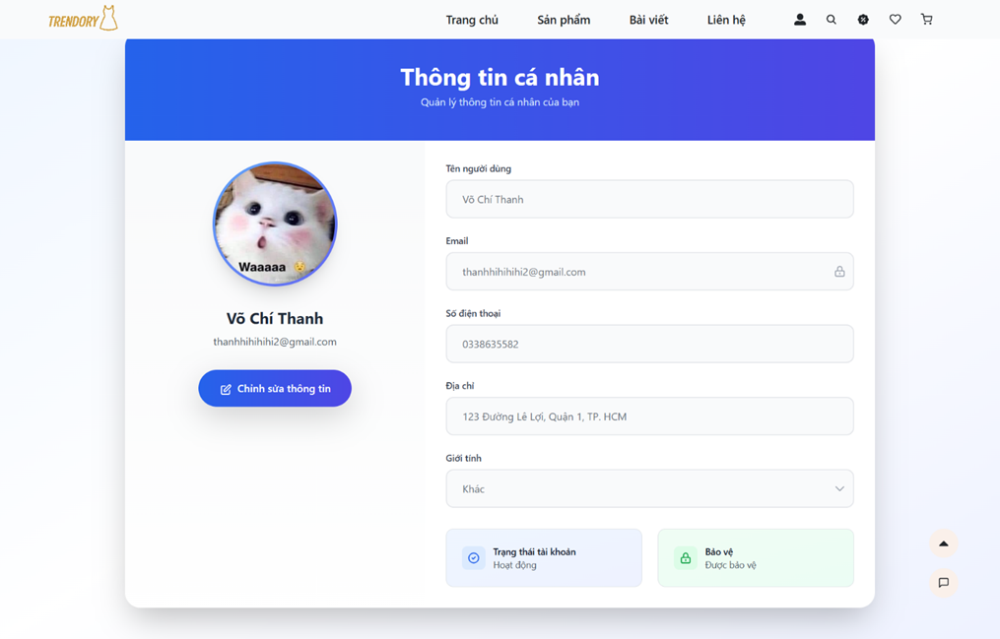

### Coupon Code Page

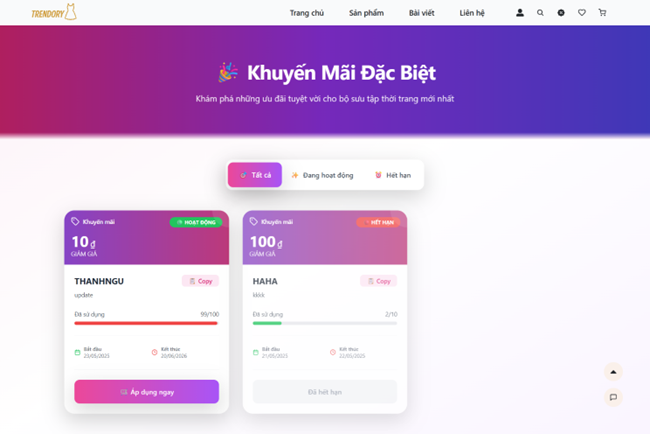

### Page Cart

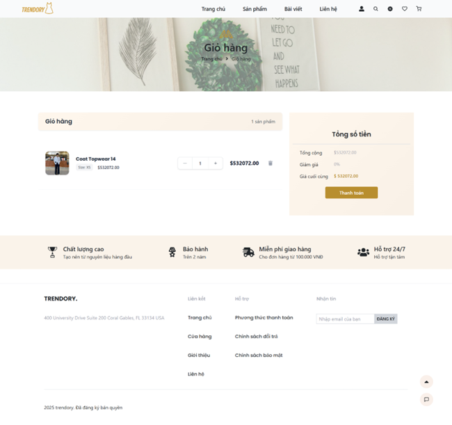

### Payment interface page

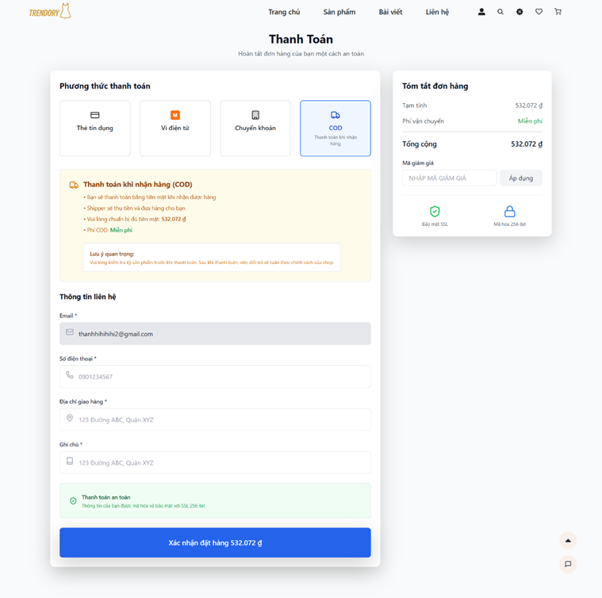
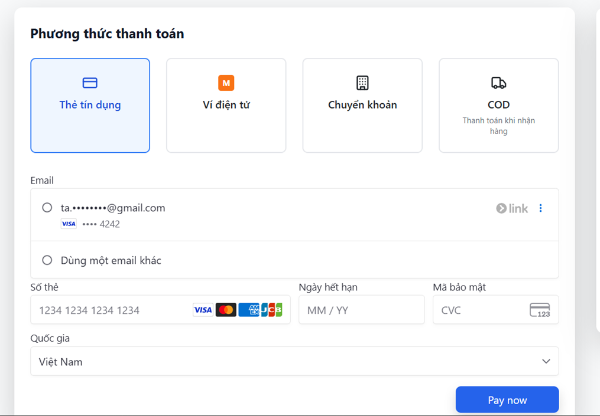
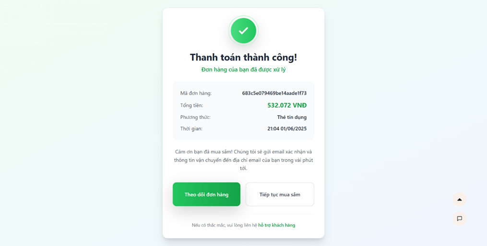

### Order Management Page

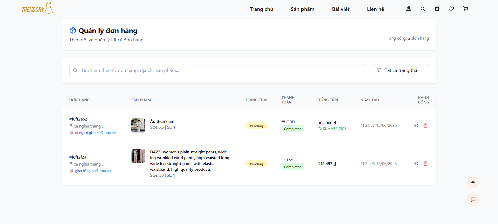
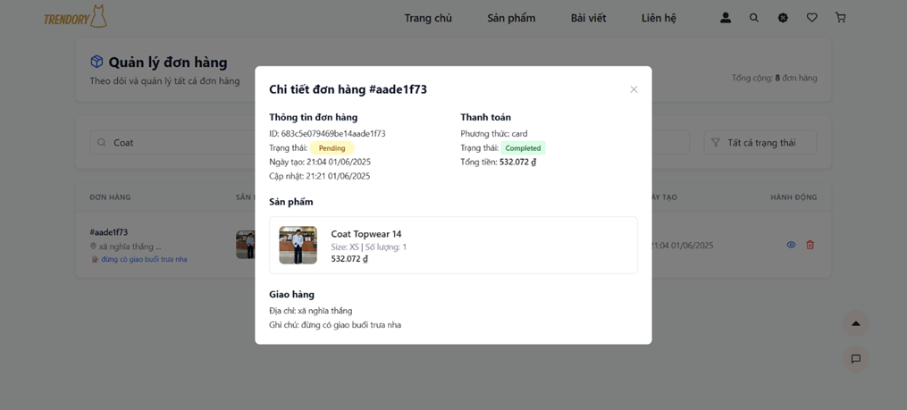
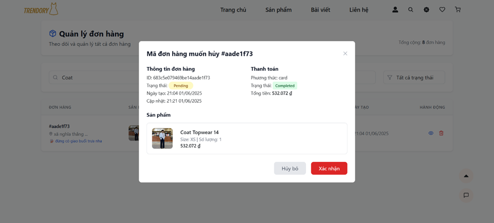

### ChatBot Interface

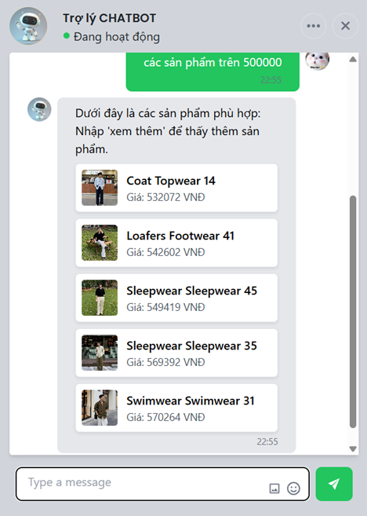

### ADMIN

### Statistics interface


### User management interface

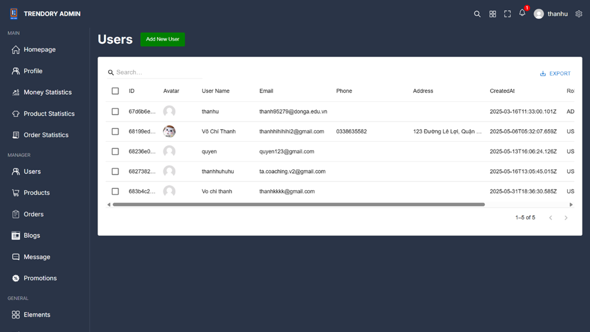

### Discount code management interface

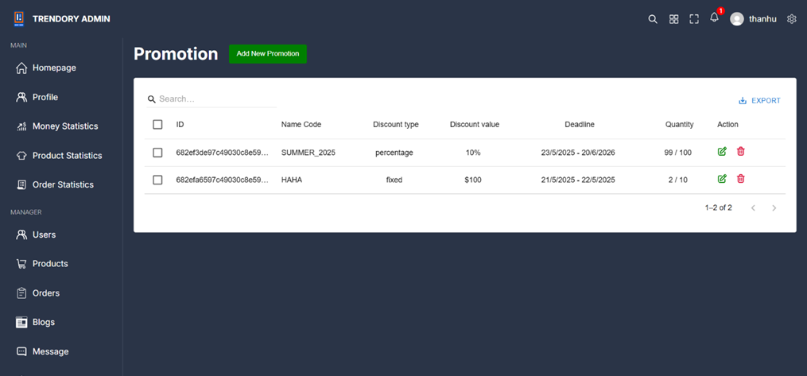

### Article management interface

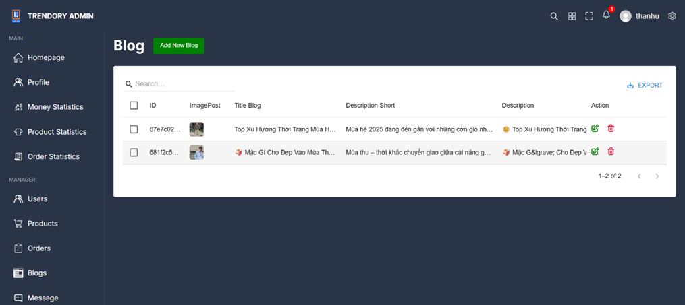

### Order management interface

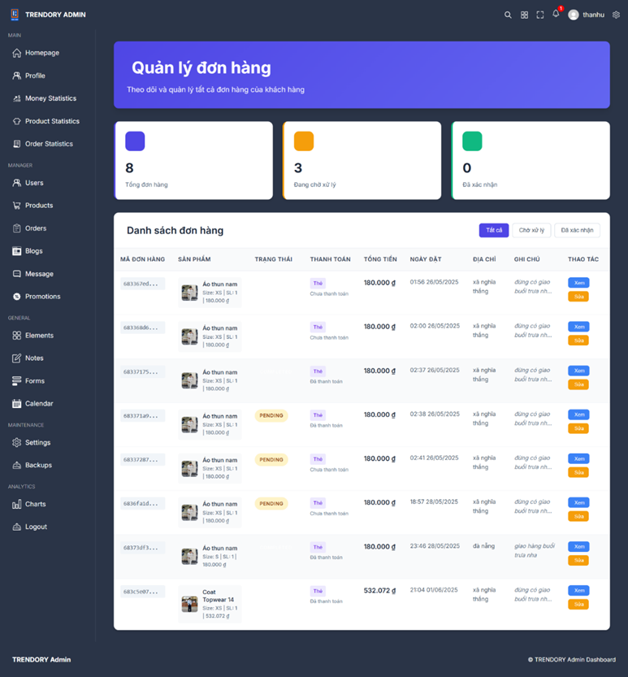

### Product management interface

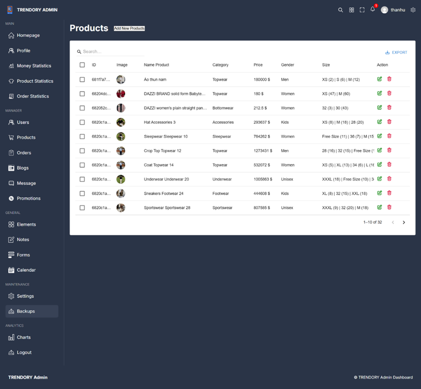
