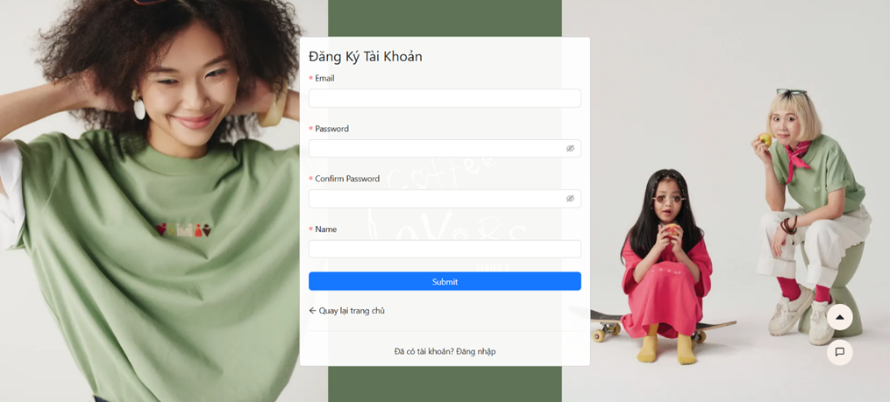

# 🛍️ Ecommerce Clothing Sales

## Overview

This is a full-stack e-commerce platform built with modern web technologies for both frontend and backend. The application provides a comprehensive set of features for managing users, products, orders, and more — with a strong focus on scalability, user experience, and secure transactions.

## 🔗 Test Project

[👉 Live Demo](https://trendory.vercel.app/)

---

## ✨ Features

- **User Management**: Register, login, profile management, and role-based access control.
- **Product Management**: Add, edit, delete, and categorize products with rich text descriptions.
- **Discount Code Management**: Create and apply discount codes for promotions.
- **Cart Management**: Add, remove, and update items in the shopping cart.
- **Wishlist**: Save favorite products for later.
- **Order Management**: Track and manage customer orders with status updates.
- **Product Reviews**: Allow users to leave personal comments and ratings.
- **Recommendation System**: Suggest products based on user behavior.
- **Blog System**: Create and manage blog posts for content marketing.
- **Search & Filters**: Search products by keywords, categories, or advanced filters.
- **Payment Integration**: Secure payments via **ZaloPay** and **Stripe**.
- **AI Chatbot**: Interactive customer support chatbot.
- **Revenue Statistics**: Generate sales and revenue reports.
- **Product Analytics**: Analyze product performance and popularity.

---

## 🧱 Tech Stack

### Admin Dashboard

- `@mui/material`: UI components for building admin interfaces.
- `@tanstack/react-query`: State and async data management.
- `tinymce`: Rich text editor.
- `recharts`: Charts and visual analytics.
- `vite`: Frontend build tool.
- `typescript`: Strongly typed JavaScript.

### Frontend

- `react`: Core UI library.
- `zustand`: State management.
- `react-query`: Data fetching and caching.
- `antd`: Component UI library.
- `tailwindcss`: Utility-first CSS.
- `stripe`: Payment processing integration.
- `lightbox.js-react`: Product image gallery.

### Backend

- `express`: Web server framework.
- `mongoose`: MongoDB ODM.
- `jsonwebtoken`: Authentication with JWT.
- `stripe`: Payment processing.
- `nodemailer`: Email sending.
- `bcrypt`: Password hashing.
- `dotenv`: Environment configuration.
- `cloudinary`: Image storage and optimization.

---

## ⚙️ Installation

### Prerequisites

- Node.js (v18 or above)
- MongoDB
- Cloudinary account
- Stripe account
- ZaloPay account

### Setup Steps

1. Clone the repository
2. Install dependencies for both frontend and backend
3. Set up your `.env` files (see example below)
4. Run the frontend and backend

```bash
# Frontend
cd frontend
npm install
npm run dev

# Backend
cd ../backend
npm install
npm start


```

## 🖼️ Screenshot

<!DOCTYPE html>
<html lang="en">
<head>
    <meta charset="UTF-8">
    <meta name="viewport" content="width=device-width, initial-scale=1.0">
    <title>Centered UI Images</title>
    <style>
        body {
            font-family: Arial, sans-serif;
            margin: 0;
            padding: 0;
            background-color: #f4f4f4;
        }

        h1, h2 {
            text-align: center;
            color: #333;
        }

        .section {
            margin: 40px 20px;
        }

        .image-gallery {
            display: flex;
            flex-wrap: wrap;
            justify-content: center;
            gap: 20px;
        }

        .image-container {
            background-color: #fff;
            border-radius: 10px;
            box-shadow: 0 4px 8px rgba(0, 0, 0, 0.1);
            padding: 15px;
            max-width: 300px;
            text-align: center;
            transition: transform 0.2s;
        }

        .image-container:hover {
            transform: scale(1.05);
        }

        .image-container img {
            max-width: 100%;
            height: auto;
            border-radius: 8px;
            object-fit: contain;
        }

        .image-caption {
            margin-top: 10px;
            font-size: 14px;
            color: #555;
        }

        @media (max-width: 600px) {
            .image-container {
                max-width: 100%;
            }
        }
    </style>

</head>
<body>
    <h1>UI Design Showcase</h1>

    <!-- Customer Section -->
    <div class="section">
        <h2>Customer Interfaces</h2>
        <div class="image-gallery">
            <div class="image-container">
                
                <div class="image-caption">Register Page</div>
            </div>
            <div class="image-container">
                
                <div class="image-caption">Login Page</div>
            </div>
            <div class="image-container">
                
                <div class="image-caption">Home Page</div>
            </div>
            <div class="image-container">
                
                <div class="image-caption">Product List Page</div>
            </div>
            <div class="image-container">
                
                <div class="image-caption">Product Detail Page</div>
            </div>
            <div class="image-container">
                
                <div class="image-caption">Favorite Products Section</div>
            </div>
            <div class="image-container">
                
                <div class="image-caption">Product Review Section</div>
            </div>
            <div class="image-container">
                
                <div class="image-caption">Shop Article Page</div>
            </div>
            <div class="image-container">
                
                <div class="image-caption">Personal Information Page</div>
            </div>
            <div class="image-container">
                
                <div class="image-caption">Coupon Code Page</div>
            </div>
            <div class="image-container">
                
                <div class="image-caption">Cart Page</div>
            </div>
            <div class="image-container">
                
                <div class="image-caption">Payment Interface Page 1</div>
            </div>
            <div class="image-container">
                
                <div class="image-caption">Payment Interface Page 2</div>
            </div>
            <div class="image-container">
                
                <div class="image-caption">Payment Interface Page 3</div>
            </div>
            <div class="image-container">
                
                <div class="image-caption">Order Management Page 1</div>
            </div>
            <div class="image-container">
                
                <div class="image-caption">Order Management Page 2</div>
            </div>
            <div class="image-container">
                
                <div class="image-caption">Order Management Page 3</div>
            </div>
            <div class="image-container">
                
                <div class="image-caption">ChatBot Interface</div>
            </div>
        </div>
    </div>

    <!-- Admin Section -->
    <div class="section">
        <h2>Admin Interfaces</h2>
        <div class="image-gallery">
            <div class="image-container">
                
                <div class="image-caption">Statistics Interface 1</div>
            </div>
            <div class="image-container">
                
                <div class="image-caption">Statistics Interface 2</div>
            </div>
            <div class="image-container">
                
                <div class="image-caption">User Management Interface</div>
            </div>
            <div class="image-container">
                
                <div class="image-caption">Discount Code Management Interface</div>
            </div>
            <div class="image-container">
                
                <div class="image-caption">Article Management Interface</div>
            </div>
            <div class="image-container">
                
                <div class="image-caption">Order Management Interface</div>
            </div>
            <div class="image-container">
                
                <div class="image-caption">Product Management Interface</div>
            </div>
        </div>
    </div>

</body>
</html>
